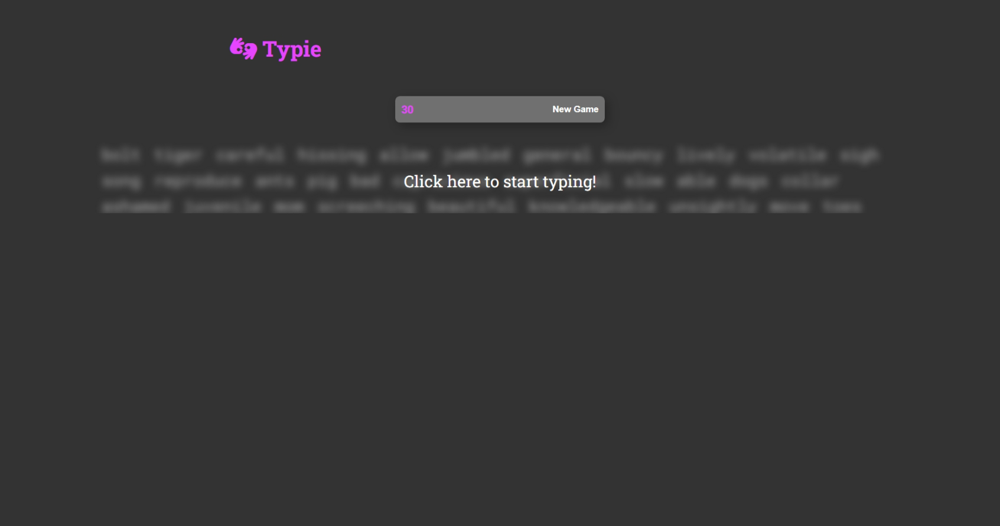

# Typing Speed Test Web App

A lightweight, **vanilla JavaScript** typing speed test application that measures your **Words Per Minute (WPM)**, accuracy, and typing efficiency in real-time.




## Features
- 📊 Real-time WPM (Words Per Minute) calculation
- ✅ Accuracy percentage tracking
- ⏱️ Countdown timer
- 📜 Random text passages for tests

## Technologies
- **Pure Vanilla JavaScript** (no frameworks)
- Semantic HTML5
- Modern CSS3 (Flexbox, variables)

## Quick Start
1. Clone the repository:
   ```bash
   git clone https://github.com/zubdotexe/typing-test-site.git
2. Open index.html in your browser.

## Credits
- Tutorial by CodingWithDawid  
